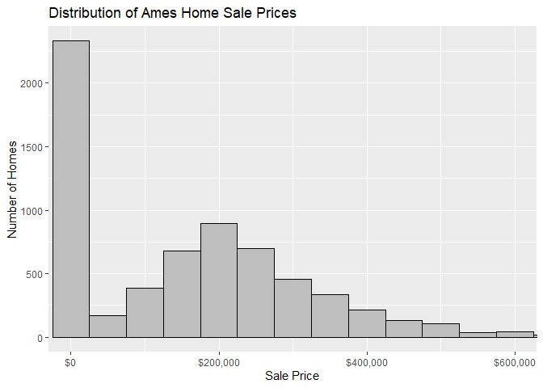
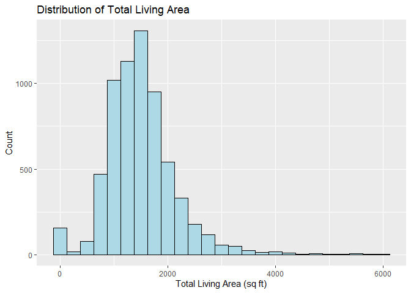
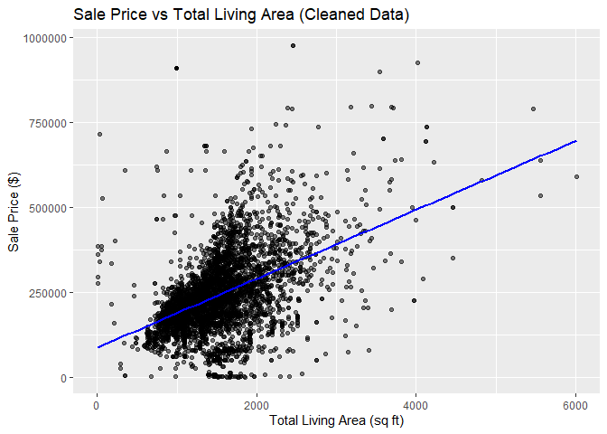
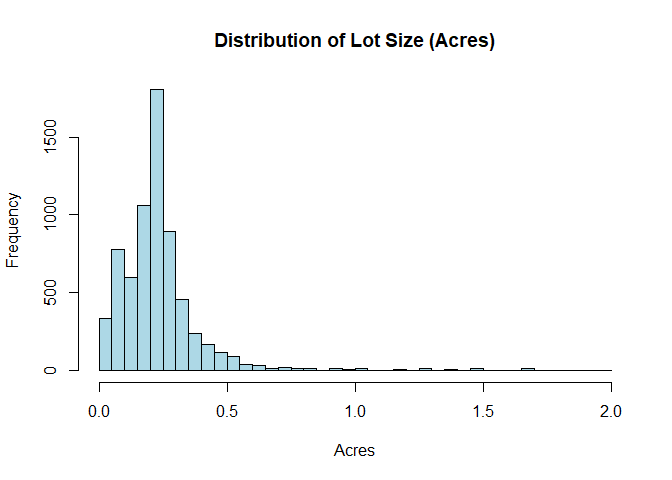
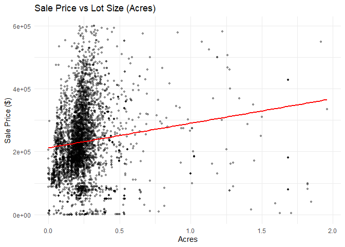
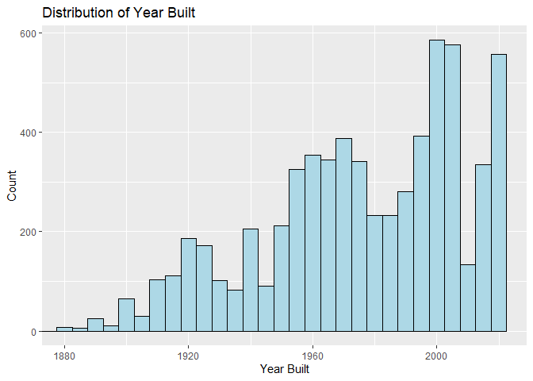
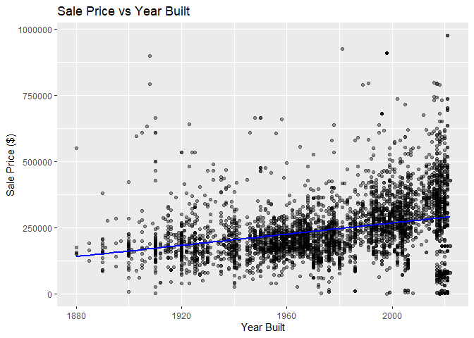
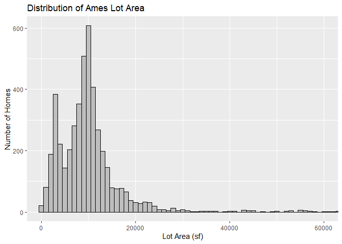
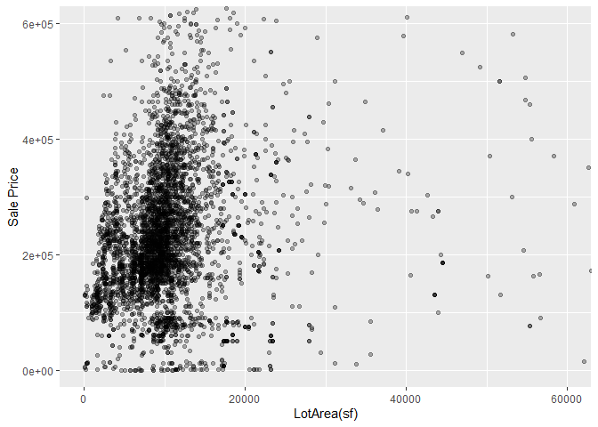

<!-- README.md is generated from README.Rmd. Please edit the README.Rmd file -->

# Lab report \#1

Follow the instructions posted at
<https://ds202-at-isu.github.io/labs.html> for the lab assignment. The
work is meant to be finished during the lab time, but you have time
until Monday evening to polish things.

Include your answers in this document (Rmd file). Make sure that it
knits properly (into the md file). Upload both the Rmd and the md file
to your repository.

All submissions to the github repo will be automatically uploaded for
grading once the due date is passed. Submit a link to your repository on
Canvas (only one submission per team) to signal to the instructors that
you are done with your submission.

Step 1 Result (Abhi’s Work):

``` r
library(classdata)
data("ames")
head(ames)
```

    ##    Parcel ID                       Address             Style
    ## 1 0903202160      1024 RIDGEWOOD AVE, AMES 1 1/2 Story Frame
    ## 2 0907428215 4503 TWAIN CIR UNIT 105, AMES     1 Story Frame
    ## 3 0909428070        2030 MCCARTHY RD, AMES     1 Story Frame
    ## 4 0923203160         3404 EMERALD DR, AMES     1 Story Frame
    ## 5 0520440010       4507 EVEREST  AVE, AMES              <NA>
    ## 6 0907275030       4512 HEMINGWAY DR, AMES     2 Story Frame
    ##                        Occupancy  Sale Date Sale Price Multi Sale YearBuilt
    ## 1 Single-Family / Owner Occupied 2022-08-12     181900       <NA>      1940
    ## 2                    Condominium 2022-08-04     127100       <NA>      2006
    ## 3 Single-Family / Owner Occupied 2022-08-15          0       <NA>      1951
    ## 4                      Townhouse 2022-08-09     245000       <NA>      1997
    ## 5                           <NA> 2022-08-03     449664       <NA>        NA
    ## 6 Single-Family / Owner Occupied 2022-08-16     368000       <NA>      1996
    ##   Acres TotalLivingArea (sf) Bedrooms FinishedBsmtArea (sf) LotArea(sf)  AC
    ## 1 0.109                 1030        2                    NA        4740 Yes
    ## 2 0.027                  771        1                    NA        1181 Yes
    ## 3 0.321                 1456        3                  1261       14000 Yes
    ## 4 0.103                 1289        4                   890        4500 Yes
    ## 5 0.287                   NA       NA                    NA       12493  No
    ## 6 0.494                 2223        4                    NA       21533 Yes
    ##   FirePlace              Neighborhood
    ## 1       Yes       (28) Res: Brookside
    ## 2        No    (55) Res: Dakota Ridge
    ## 3        No        (32) Res: Crawford
    ## 4        No        (31) Res: Mitchell
    ## 5        No (19) Res: North Ridge Hei
    ## 6       Yes   (37) Res: College Creek

``` r
library(tibble)
library(knitr)

step1_table <- tibble(
  Variable = c(
    "Parcel ID",
    "Address",
    "Style",
    "Occupancy",
    "Sale Date",
    "Sale Price",
    "Multi Sale",
    "YearBuilt",
    "Acres",
    "TotalLivingArea (sf)",
    "Bedrooms",
    "FinishedBsmtArea (sf)",
    "LotArea (sf)",
    "AC",
    "FirePlace",
    "Neighborhood"
  ),
  Type = c(
    "Character",
    "Character",
    "Character",
    "Character",
    "Date",
    "Numeric",
    "Character",
    "Numeric",
    "Numeric",
    "Numeric",
    "Numeric",
    "Numeric",
    "Numeric",
    "Character",
    "Character",
    "Character"
  ),
  Meaning = c(
    "Unique property identifier",
    "Property address",
    "Building style",
    "Type of occupancy",
    "Date property was sold",
    "Final sale price in dollars",
    "Whether multiple sales occurred",
    "Year property was built",
    "Lot size in acres",
    "Total above-ground living area in square feet",
    "Number of bedrooms",
    "Finished basement area in square feet",
    "Lot size in square feet",
    "Whether home has air conditioning",
    "Whether home has fireplace",
    "Neighborhood classification"
  ),
  Expected_Range = c(
    "Unique values",
    "Text",
    "Categories",
    "Categories",
    "2017–2024+",
    "0–1,000,000+",
    "NA/Yes",
    "1900–2024",
    "0–5+",
    "500–5000+",
    "0–6",
    "0–3000",
    "1,000–50,000+",
    "Yes/No",
    "Yes/No",
    "Categories"
  )
)

kable(step1_table, caption = "Step 1: Dataset Variables Overview")
```

| Variable | Type | Meaning | Expected_Range |
|:---|:---|:---|:---|
| Parcel ID | Character | Unique property identifier | Unique values |
| Address | Character | Property address | Text |
| Style | Character | Building style | Categories |
| Occupancy | Character | Type of occupancy | Categories |
| Sale Date | Date | Date property was sold | 2017–2024+ |
| Sale Price | Numeric | Final sale price in dollars | 0–1,000,000+ |
| Multi Sale | Character | Whether multiple sales occurred | NA/Yes |
| YearBuilt | Numeric | Year property was built | 1900–2024 |
| Acres | Numeric | Lot size in acres | 0–5+ |
| TotalLivingArea (sf) | Numeric | Total above-ground living area in square feet | 500–5000+ |
| Bedrooms | Numeric | Number of bedrooms | 0–6 |
| FinishedBsmtArea (sf) | Numeric | Finished basement area in square feet | 0–3000 |
| LotArea (sf) | Numeric | Lot size in square feet | 1,000–50,000+ |
| AC | Character | Whether home has air conditioning | Yes/No |
| FirePlace | Character | Whether home has fireplace | Yes/No |
| Neighborhood | Character | Neighborhood classification | Categories |

Step 1: Dataset Variables Overview

- Step 2 (Yash’s work): We choose “Sale Price” as the main variable for
  our work.

- Step 3 (Kate’s work): The range is max - min which is 20500000 - 0
  = 20500000. The data is skewed right with 2 significant outliers at
  ~2mil and ~1.5mil. The median is 170900 and the IQR is 280000.

``` r
library(classdata)
data("ames")

library(ggplot2)
library(scales)

ggplot(ames, aes(x = `Sale Price`)) +
  geom_histogram(binwidth = 50000, color = "black", fill = "gray") +
  coord_cartesian(xlim = c(0, 600000)) +
  scale_x_continuous(labels = label_dollar()) +
  labs(
    title = "Distribution of Ames Home Sale Prices",
    x = "Sale Price",
    y = "Number of Homes"
  )
```

<!-- -->

``` r
sum(ames$`Sale Price` == 0)
```

    ## [1] 2206

- Step 3 continuation (Yash’s work): Upon plotting the histogram, I
  noticed there were 2206 observations at 0 dollars for sale price.
  These likely indicate placeholder, or missing values since houses are
  never sold for free. Extreme outliers such as prices around 1.5-2
  million dollars are not shown in the plot to better visualize the
  overall distribution of the sale prices, and to make the plot
  readable. After doing so, the distribution appears right skewed, with
  most homes selling between approximately 100000 and 300000 dollars
  respectively, with the most amount of houses selling at 200000
  dollars.

Step 4:  
- Abhi’s work:

I chose **TotalLivingArea (sf)** as a variable that may be related to
the main variable, **Sale Price**, because larger homes are generally
expected to sell for higher prices.

**Range of TotalLivingArea (sf)**.

``` r
living_area <- ames$`TotalLivingArea (sf)`

min(living_area, na.rm = TRUE)
```

    ## [1] 0

``` r
max(living_area, na.rm = TRUE)
```

    ## [1] 6007

From the output, the minimum is 0 square feet, the maximum is 6007
square feet, so the range would be 0 square feet to 6007 square feet.
The minimum value of 0 sq ft is unusual and likely represents missing or
incorrectly entered data.

**Distribution of TotalLivingArea (sf)**.

``` r
library(ggplot2)

ggplot(ames, aes(x = `TotalLivingArea (sf)`)) +
  geom_histogram(binwidth = 250, color = "black", fill = "lightblue") +
  labs(
    title = "Distribution of Total Living Area",
    x = "Total Living Area (sq ft)",
    y = "Count"
  )
```

    ## Warning: Removed 447 rows containing non-finite outside the scale range
    ## (`stat_bin()`).

<!-- -->

The distribution is right-skewed. Most homes fall between 1,000 and
2,500 square feet. A small number of homes are very large (above 4,000
sq ft). There are also a few values near 0 sq ft, which appear
suspicious.

**Relationship Between TotalLivingArea and Sale Price**.

``` r
library(classdata)
library(dplyr)
```

    ## 
    ## Attaching package: 'dplyr'

    ## The following objects are masked from 'package:stats':
    ## 
    ##     filter, lag

    ## The following objects are masked from 'package:base':
    ## 
    ##     intersect, setdiff, setequal, union

``` r
library(ggplot2)

data("ames")

ames_clean <- ames %>%
  filter(`Sale Price` > 0,
         `Sale Price` < 1000000,
         `TotalLivingArea (sf)` > 0)

ggplot(ames_clean, aes(x = `TotalLivingArea (sf)`, y = `Sale Price`)) +
  geom_point(alpha = 0.5) +
  geom_smooth(method = "lm", se = FALSE, color = "blue") +
  labs(
    title = "Sale Price vs Total Living Area (Cleaned Data)",
    x = "Total Living Area (sq ft)",
    y = "Sale Price ($)"
  )
```

    ## `geom_smooth()` using formula = 'y ~ x'

<!-- -->

After removing homes with Sale Price equal to 0 and extreme outliers
above \$1,000,000, the relationship between Total Living Area and Sale
Price shows a clear positive linear trend. Larger homes generally sell
for higher prices. Most homes fall between 1,000 and 2,500 square feet
and sell between \$100,000 and \$400,000. There is greater variability
in sale price among larger homes. The very large homes help explain the
extreme high sale price outliers observed in Step 3, as properties with
greater square footage tend to command much higher prices and contribute
to the right-skew. However, this variable does not explain the \$0 sale
prices, which likely represent missing or incorrectly recorded data.

Keaton’s Work:

The range of the variables Acres spans from 0.000 to 12.012, making the
total range 12.012. It is interesting to have a home with 0 acres so
there must be missing information.

``` r
hist(ames$Acres[ames$Acres <= 2],
     breaks = seq(0, 2, by = 0.05),
     main = "Distribution of Lot Size (Acres)",
     xlab = "Acres",
     col = "lightblue")
```

<!-- -->

``` r
library(dplyr)
library(ggplot2)

ames_small <- ames %>%
  filter(`Sale Price` > 0,
         `Sale Price` < 600000,
         Acres < 2)

ggplot(ames_small, aes(x = Acres, y = `Sale Price`)) +
  geom_point(alpha = 0.35, size = 1.2) +
  geom_smooth(method = "lm", se = FALSE, color = "red") +
  labs(title = "Sale Price vs Lot Size (Acres)",
       x = "Acres",
       y = "Sale Price ($)") +
  theme_minimal()
```

<!-- -->

Explanation: For the variable Acres, it is heavily right skewed. Almost
every piece of data in the data set comes from under 2 acres. Within
that almost every point is within 0.5 acres, with a long but sparse tail
of high amounts of acres. When looking at the relationship between acres
and sale price the correlation is weak. This is uprising because it
would be expected for the price to increase as the amount of acres
associated with the home. The relationship is weak due to the high
volume of lower priced homes on limited land. When looking at the
oddities found in step 3, the variable of acres can fix to highlight
some. Homes that are on large pieces of can be the reasoning for why the
price is so large. That the sale price is most related to the amount of
land versus the actual home. While the acreage can account for some of
the high outlines it does not account for the high consistent of lower
values.

-Step 4 (Yash’s Work): I choose YearBuilt as a variable that may be
related to Sale Price, since newer homes are often expected to sell at
higher prices.

``` r
year_built <- ames$YearBuilt
range(year_built[year_built > 0], na.rm = TRUE)
```

    ## [1] 1880 2022

- After excluding values of 0, which likely represent placeholder or
  missing values, the range of the variable YearBuilt is from 1880 to
  2022.

``` r
ggplot(ames, aes(x = YearBuilt)) +
  geom_histogram(binwidth = 5, color = "black", fill = "lightblue") +
  coord_cartesian(xlim = c(1880, 2022)) +
  labs(
    title = "Distribution of Year Built",
    x = "Year Built",
    y = "Count"
  )
```

    ## Warning: Removed 447 rows containing non-finite outside the scale range
    ## (`stat_bin()`).

<!-- -->

- The distribution of YearBuilt is left skewed. After limiting the
  display range from 1880 to 2022 to remove invalid values such as 0,
  the histogram shows that relatively few homes were built before 1900.
  After 1900, construction of properties gradually increased and rose
  significantly after the 1950s. The largest concentration of homes
  appears from 1990 till 2022, suggesting that massive amounts of
  properties in the dataset have been built in recent decades.

``` r
ames_year <- ames |>
  dplyr::filter(`Sale Price` > 0,
                `Sale Price` < 1000000,
                YearBuilt > 0)

ggplot(ames_year, aes(x = YearBuilt, y = `Sale Price`)) +
  geom_point(alpha = 0.4) +
  geom_smooth(method = "lm", se = FALSE, color = "blue") +
  labs(
    title = "Sale Price vs Year Built",
    x = "Year Built",
    y = "Sale Price ($)"
  )
```

    ## `geom_smooth()` using formula = 'y ~ x'

<!-- -->

- The scatterplot shows a weak-to-moderate positive linear relationship
  between YearBuilt and Sale Price. In general, homes built more
  recently tend to sell for higher prices compared to older homes. The
  regression line shows a gradual upward trend, indicating that
  properties constructed in later years are typically associated with
  higher sale prices. However, there is a considerable variation in sale
  prices across construction years, suggesting that other factors such
  as total living area, neighborhood, and property features also
  influence the final sale price. A few high-priced homes appear in the
  scatterplot, with sale prices reaching \$1000000. This is consistent
  with the extreme outliers we detected in Step 3. These properties are
  likely larger or higher-quality homes built very recently. While these
  outliers exist, they do not impact the general trend of the data. The
  variable YearBuilt also does not explain the sale prices at 0 dollars
  observed earlier in step 3, which likely represent missing or
  incorrectly recorded data rather than actual property sales.

- Step 4 (Kate’s Work): I chose the variable Lot Area (sf) to be related
  to sale price as the price of land and the amount of land a property
  contains can directly affect the price of a home.

Range:

``` r
lotArea <- ames$`LotArea(sf)`
lotArea <- na.omit(lotArea)
lotAreaRange <- range(lotArea)
lotAreaRange
```

    ## [1]      0 523228

The range is 523228-0 = 523228.

``` r
ames_sf <- ames |>
  dplyr::filter(`Sale Price` > 0,
                 `LotArea(sf)` > 0)

  ggplot(ames_sf, aes(x = `LotArea(sf)`)) +
  geom_histogram(binwidth = 1000, color = "black", fill = "gray") +
  coord_cartesian(xlim = c(0, 60000)) +
  labs(
    title = "Distribution of Ames Lot Area",
    x = "Lot Area (sf)",
    y = "Number of Homes"
  )
```

<!-- -->

``` r
summary(lotArea)
```

    ##    Min. 1st Qu.  Median    Mean 3rd Qu.    Max. 
    ##       0    6553    9575   11466   12088  523228

The pattern of the Lot Area (sf) is skewed right with median of 9575 sf
and an IQR of 4913 sf. There are a few outliers close to the maximum.

``` r
ggplot(ames_sf, aes(x = `LotArea(sf)`, y= `Sale Price`)) +
  geom_point(alpha=0.3) +coord_cartesian(xlim = c(0, 60000), ylim = c(0,600000))
```

<!-- -->

``` r
  labs(
    title = "Distribution of Ames Lot Area",
    x = "Lot Area (sf)",
    y = "Number of Homes"
  )
```

    ## <ggplot2::labels> List of 3
    ##  $ x    : chr "Lot Area (sf)"
    ##  $ y    : chr "Number of Homes"
    ##  $ title: chr "Distribution of Ames Lot Area"

The scatterplot (when reduced to the x/y constraints of the prior
graphs) shows a r value close to 0 as the dots primarily form a large
cluster from Lot Area = 1 to Lot Area = 200 and between Sale Price = 1
to Sale Price = 6 million. To avoid any of the oddities we notice in
Part 3, we removed all Sale Price and Lot Area values that were 0 as we
determined those were placeholder values. This scatterplot indicates
that the Sale Price can differ substantially even with similiar Lot
Areas.
