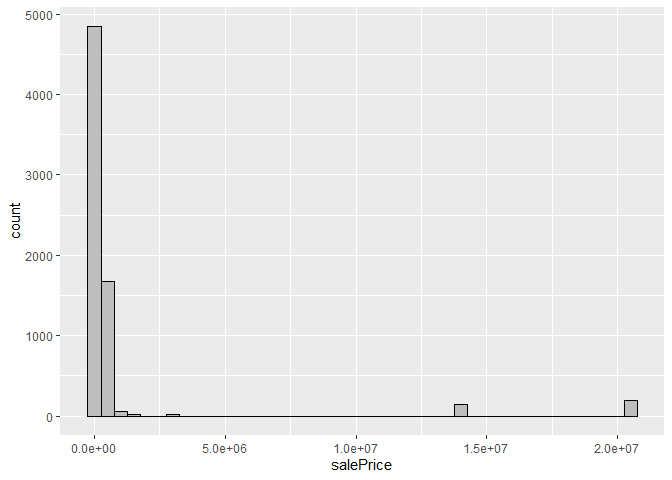

<!-- README.md is generated from README.Rmd. Please edit the README.Rmd file -->

# Lab report \#1

Follow the instructions posted at
<https://ds202-at-isu.github.io/labs.html> for the lab assignment. The
work is meant to be finished during the lab time, but you have time
until Monday evening to polish things.

Include your answers in this document (Rmd file). Make sure that it
knits properly (into the md file). Upload both the Rmd and the md file
to your repository.

All submissions to the github repo will be automatically uploaded for
grading once the due date is passed. Submit a link to your repository on
Canvas (only one submission per team) to signal to the instructors that
you are done with your submission.

library(classdata) data(“ames”) head(ames)

Step 1 Result (Abhi’s Work):

As a team, we found the variables for the dataset: Variable Type Meaning
Expected Range 1. Parcel ID Character Unique property identifier Unique
values 2. Address Character Property address Text 3. Style Character
Building style Categories 4. Occupancy Character Type of occupancy
Categories 5. Sale Date Date Date property was sold 2017–2024+ 6. Sale
Price Numeric Final sale price in dollars 0 – 1,000,000+ 7. Multi Sale
Character Whether multiple sales occurred NA/Yes 8. YearBuilt Numeric
Year property was built 1900–2024 9. Acres Numeric Lot size in Acres
0–5+ 10. TotalLivingArea Numeric Total above-ground living area in
square feet 500–5000+ 11. Bedrooms Numeric Number of bedrooms 0-6 12.
FinishedBsmtArea Numeric Finished basement area in square feet 0–3000
13. LotArea Numeric Lot size in square feet 1,000–50,000+ 14. AC
Character Whether home has air conditioning Yes/No 15. FirePlace
Character Whether home has fireplace Yes/No 16. Neighborhood Character
Neighborhood classification Categories

- Step 2 (Yash’s work): We choose “Sale Price” as the main variable for
  our work.

- Step 3 (Kate’s work): The range is max - min which is 20500000 - 0
  = 20500000. The data is skewed right with 2 significant outliers at
  ~2mil and ~1.5mil. However, most of the data falls below 200k.

``` r
library(classdata)
library(ggplot2)

salePrice <- ames$`Sale Price`
range <- max(salePrice) - min(salePrice)

ggplot(ames, aes(x = salePrice)) +
  geom_histogram(binwidth = 500000, color = "black", fill = "gray")
```

<!-- -->
